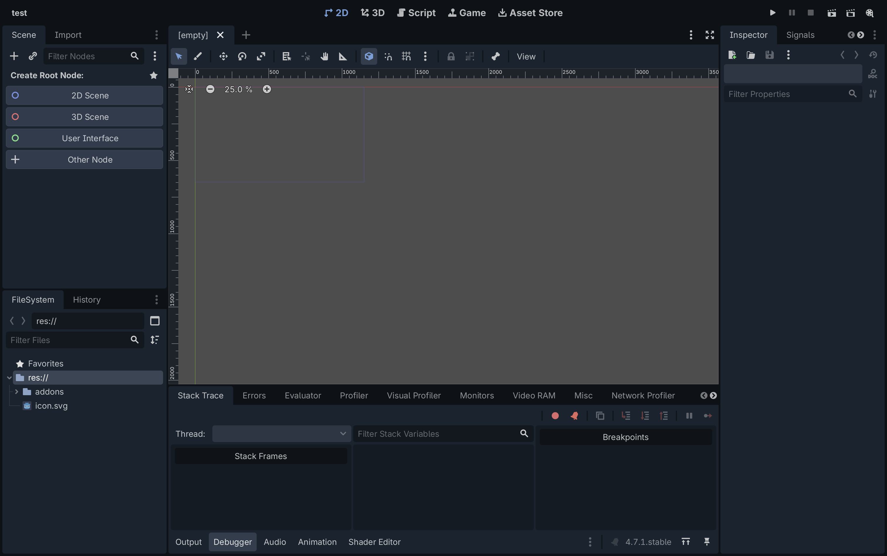
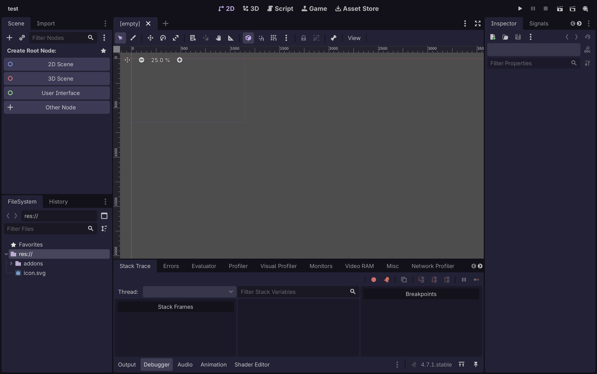
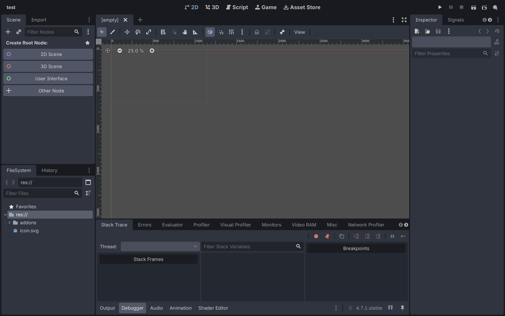
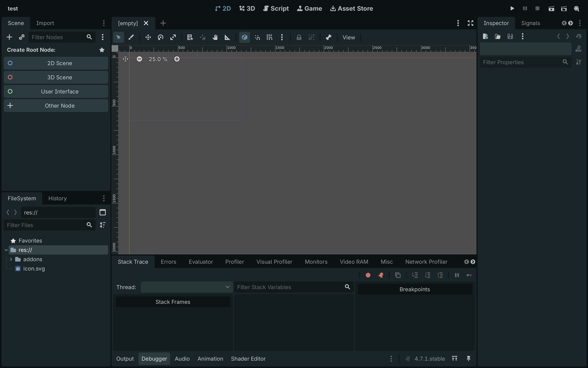
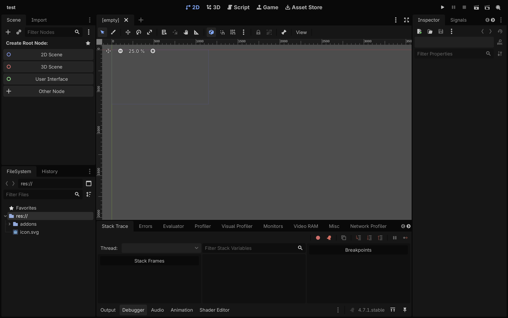
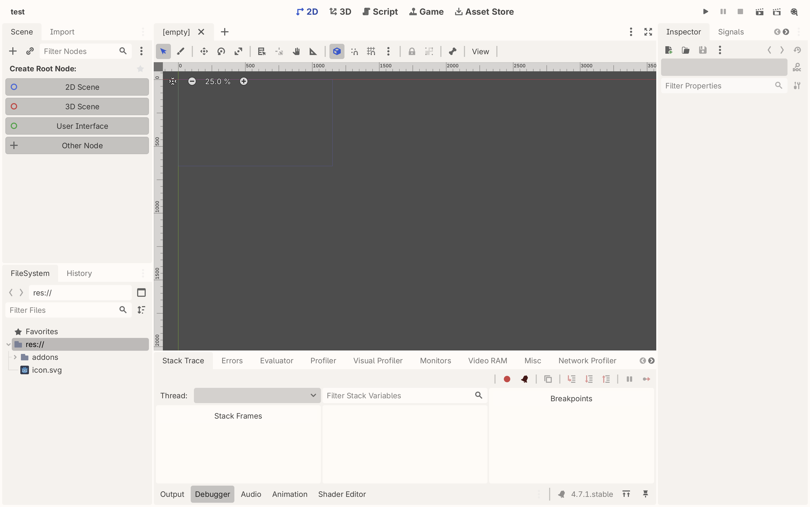
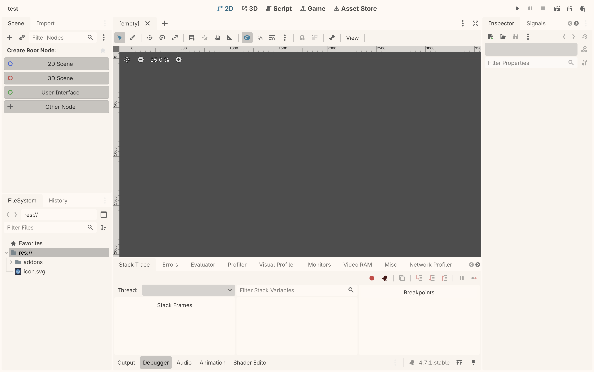

# Nightfox for Godot

The [Nightfox](https://github.com/EdenEast/nightfox.nvim) palette for the Godot editor —
both the UI chrome and the script editor. Tested on Godot 4.7.1.

Five dark variants:

|  |  |
| --- | --- |
| `nightfox`<br> | `duskfox`<br> |
| `nordfox`<br> | `terafox`<br> |
| `carbonfox`<br> | |

Two light:

|  |  |
| --- | --- |
| `dayfox`<br> | `dawnfox`<br> |

## Install

Download the repo zip, then in Godot:

1. **AssetLib → Import**, pick the zip, tick **Ignore asset root**, **Install**.
2. **Project Settings → Plugins** → enable **Nightfox Themes**.
3. **Project → Tools → Nightfox Theme** → pick a variant.

Ignoring the asset root matters: Godot only finds plugins directly under `res://addons/`.
Copying `addons/nightfox/` in by hand works too — start at step 2.

Editor settings are global, so one install themes every project you open.

## Themes without the plugin

**Tools → Nightfox Theme → Install theme files for the Color Theme menu** copies the seven
`.tet` files into Godot's theme folder. Restart, and they appear under **Editor Settings →
Text Editor → Theme → Color Theme**; the plugin can then be disabled. **Remove installed
theme files** deletes only those seven.

Worth doing: `.tet` files survive engine upgrades, while editor settings are tied to the
version series, so a new series needs the UI colors re-applying.

## Reverting

Set **Editor Settings → Interface → Theme → Preset** back to `Default`, and **Text Editor →
Theme → Color Theme** back to `Default`.

## Regenerating

`generator/godot.lua` is a Nightfox `extra` generator that writes the `.tet` files in
`addons/nightfox/themes/`.

```sh
git clone https://github.com/EdenEast/nightfox.nvim && cd nightfox.nvim
cp ../generator/godot.lua lua/nightfox/extra/godot.lua
# add to the `extras` table in misc/extra.lua:
#   godot = { ext = "tet", use_spec_name = true },
nvim --headless --clean -u misc/extra.lua
cp extra/*/*.tet ../addons/nightfox/themes/
```

This repo is itself a Godot project, so you can enable the addon here and test in place.
`demo.gd` is a syntax specimen covering all 49 color keys.

## Limits

The script editor is an exact port — all 49 keys are set. The UI is a close match, not an
exact one: Godot derives its chrome from a base color, an accent and a contrast value
rather than a full color file.

## Credits

Palette by [EdenEast](https://github.com/EdenEast/nightfox.nvim), MIT. Port MIT.
